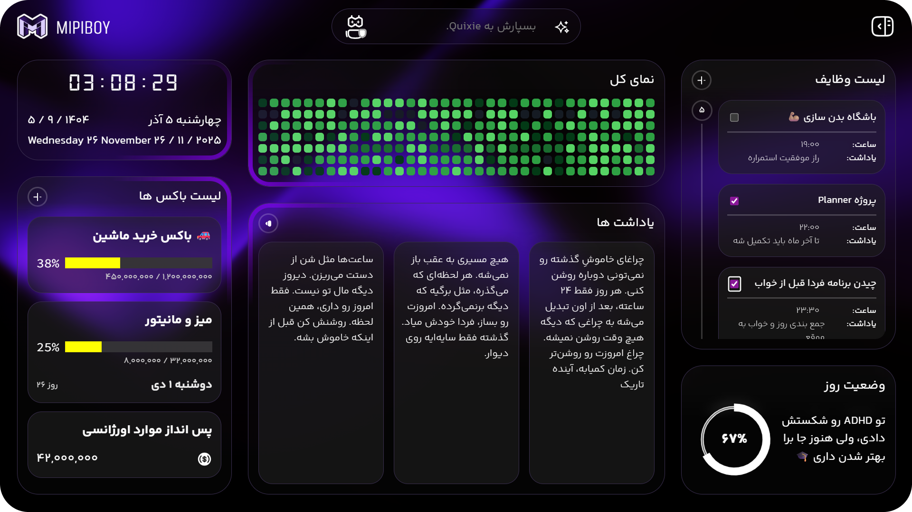
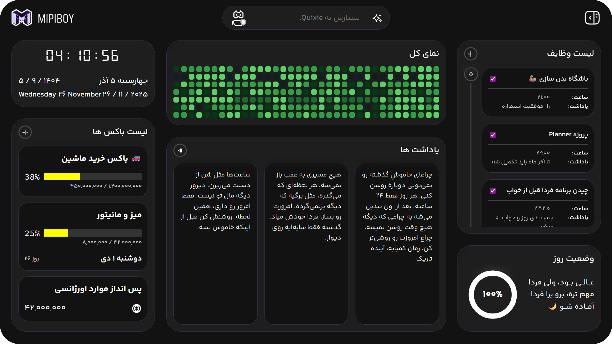
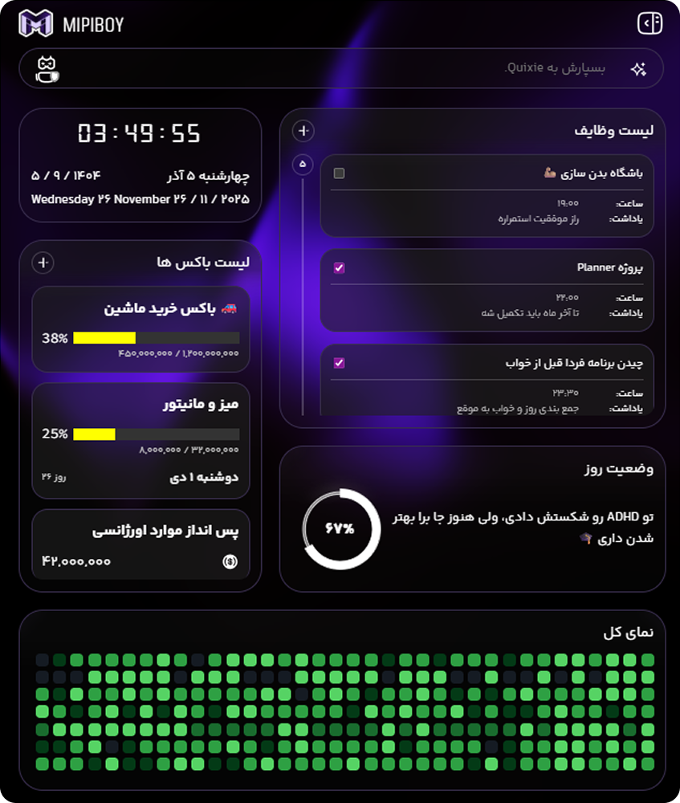
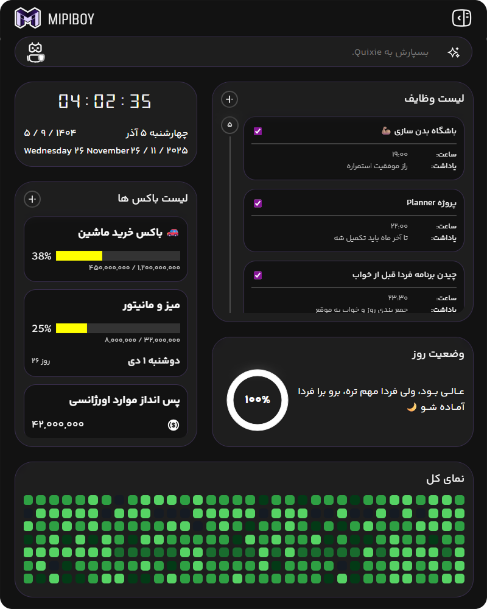
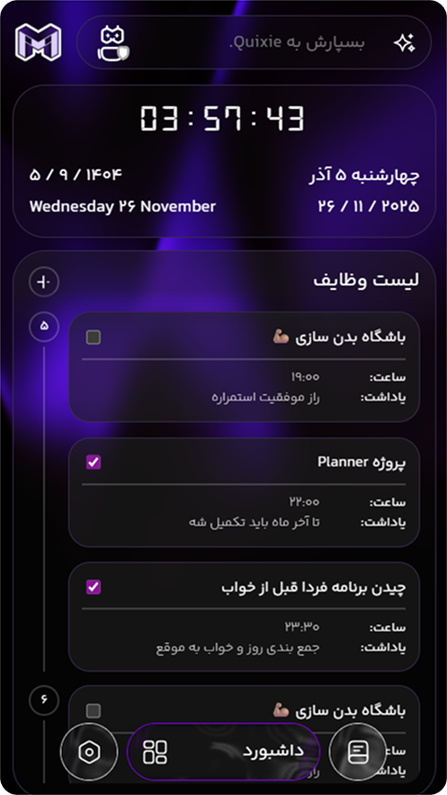
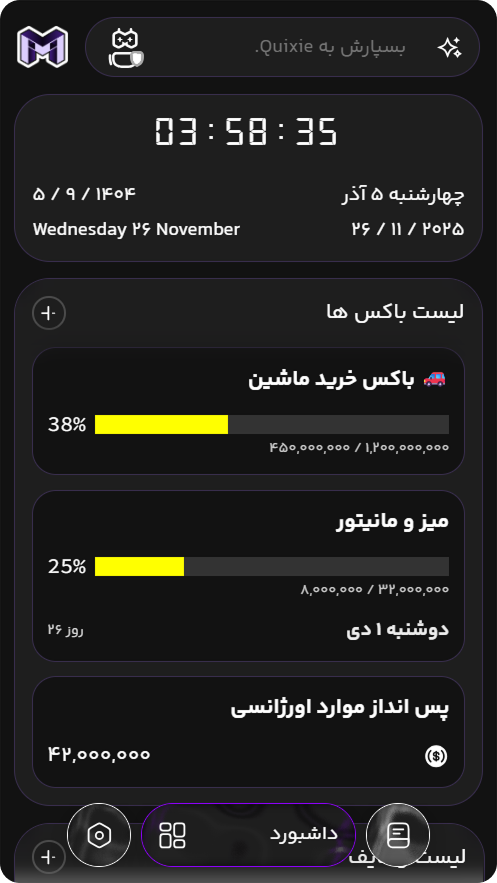

# پلنر MiPiBoy
## 📝 توضیحات پروژه
این پروژه یک اپلیکیشن چندمنظوره برای مدیریت و برنامه‌ریزی شخصی است. هدف آن ایجاد یک محیط یکپارچه برای کنترل کارهای روزانه، مدیریت مالی، یادداشت‌برداری و دسترسی سریع به سایت‌های پرکاربرد است.

### امکانات اصلی 
- برنامه‌ریزی روزانه: ثبت و مدیریت کارهای روزمره در قالب لیست‌های ساده و قابل پیگیری.
- باکس‌های پس‌انداز: بخش ویژه برای مدیریت اهداف مالی و پیگیری روند پس‌انداز.
- یادداشت‌ها: امکان نوشتن یادداشت‌های کوتاه یا بلند برای ثبت ایده‌ها و نکات مهم.
- میانبرها: دسترسی سریع به وب‌سایت‌های پر استفاده برای صرفه‌جویی در زمان.

### بخش رسیدگی به پروژه (در حال توسعه)
- تعریف فیچرها و تعیین ددلاین برای هر وظیفه.
- اختصاص هر تسک به فرد مناسب در تیم.
- مدیریت پیشرفت پروژه و هماهنگی بین اعضا.

### بخش دانشگاه (در حال توسعه)
- برنامه‌ریزی هفتگی کلاس‌های درسی.
- هماهنگ‌سازی کلاس‌ها با برنامه کاری روزانه.
- مدیریت تمرین‌ها و امتحان‌های هر هفته.
- ایجاد تعادل بین کارهای دانشگاهی و فعالیت‌های شخصی.

## 📷 اسکرین شات ها

### دسکتاپ Dark Violet

### دسکتاپ

### تبلت Dark Violet

### تبلت

### موبایل Dark Violet

### موبایل

## 👨🏻‍💻 توضیحات فنی

## 🚀 دمو زنده
برای مشاهده دمو آنلاین پروژه، به لینک زیر مراجعه کنید:  
[🌐 مشاهده دمو](https://mipiboy.ir)

## ⚙️ نحوه نصب و راهاندازی
